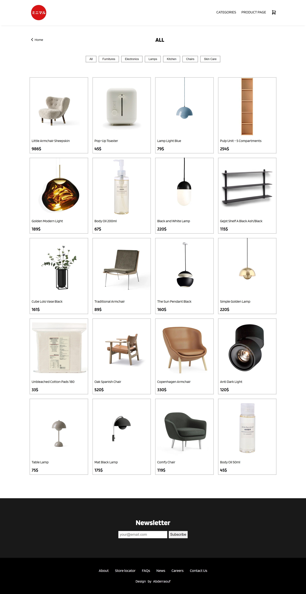
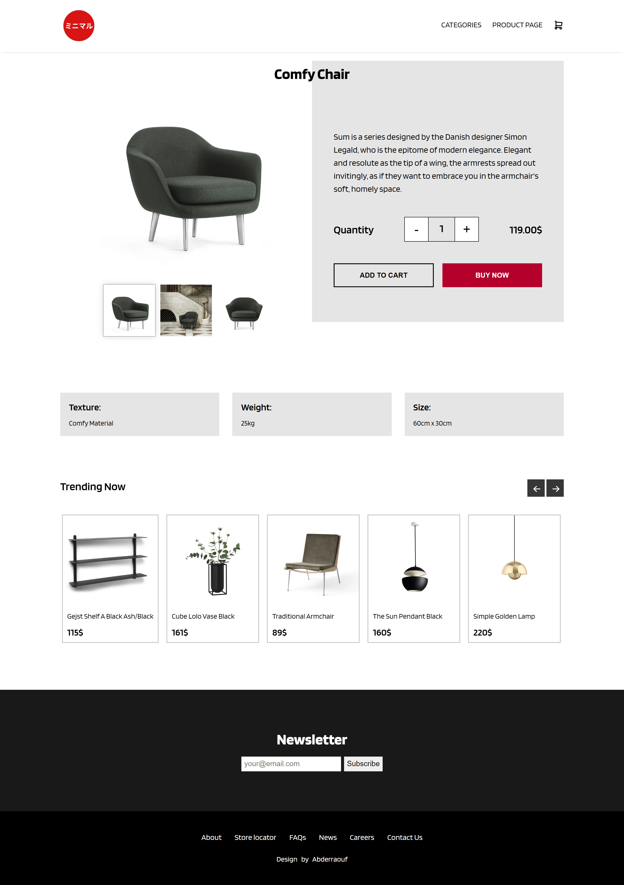
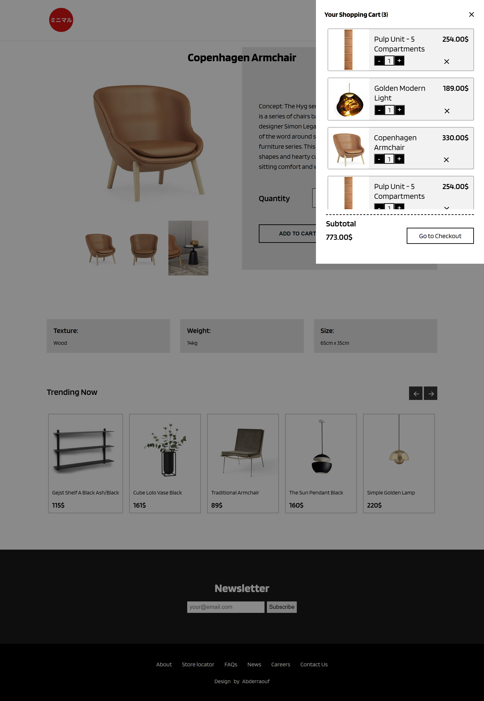

<h2>Screenshots of the Project 📸</h2>
 
<h3 align='center'>Home Page 🏡</h3>

  
<h3 align='center'>Categories Page 👇</h3>

 
 
<h3 align='center'>Products Page 👇</h3>

 
 
<h3 align='center'>ShoppingCart Page 👇</h3>

 
 

# E-Commerce Website Project

This project is an e-commerce website built using React. It includes features for browsing different product categories, adding items to the cart, and viewing product details.

## Project Structure

The project is structured as follows:

- **Components**: Contains reusable components used throughout the application.

- **Pages**: Contains different pages of the website. Each page is a React component responsible for rendering specific content.
  - `HomePage`: Renders the homepage content.
  - `CategoriesPage`: Renders information on the different Categories of items sold.
  - `ProductPage`: Renders a selection of the different products present.

## Routing

The application uses `react-router-dom` for routing. Different routes are defined for each page, and corresponding components are rendered based on the URL.

## Usage

To run the project locally:

1. Clone the repository.
2. Install dependencies using `npm install`.
3. Start the development server using `npm start`.

## Technologies Used

- React: A JavaScript library for building user interfaces.
- react-router-dom: DOM bindings for React Router, used for routing in the application.

## Contributing

Contributions are welcome! If you'd like to contribute to this project, please fork the repository and submit a pull request with your changes.

## License

This project is licensed under the MIT License - see the [LICENSE](./LICENSE) file for details.
